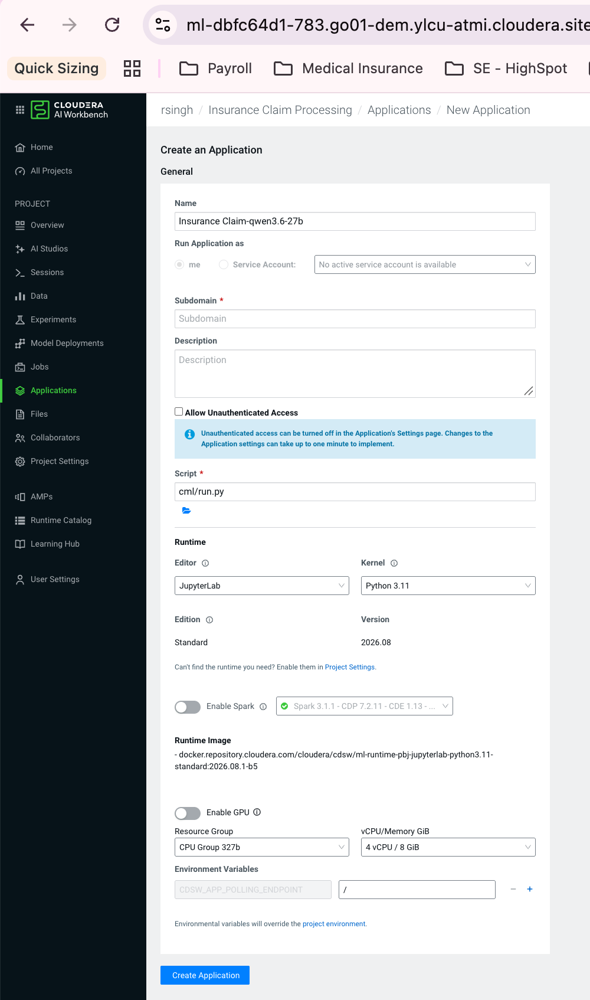

# Cloudera AI (Workbench / CML) automation

Everything is driven through one dispatcher, `cml/cli.sh`. All scripts
auto-detect the repo root, so the clone name doesn't matter.

```
cml/
├── cli.sh       ← single entrypoint — run this
├── lib.sh       ← shared helpers (logging, .env validation, change detection)
├── doctor.sh    ← preflight checks, read-only
├── setup.sh     ← one-shot bootstrap (idempotent, incremental)
├── appctl.sh    ← start/stop/status/logs for Session-terminal testing
├── update.sh    ← git pull + reinstall only what changed
├── reset.sh     ← wipe local demo state (SQLite/Chroma/storage)
├── smoke.sh     ← post-deploy endpoint checks
├── portcheck.sh ← what's listening on a port (no ss/lsof/fuser needed)
├── diagnose.sh  ← bundles doctor+status+portcheck+logs into one shareable file
├── lakehouse.sh ← Iceberg/Impala datalakehouse seed/verify/ingest (Phases 1 & 3)
├── jobs/
│   └── lakehouse_ingest_job.py ← CML Job wrapper: scheduled lakehouse ingest refresh (Phase 4)
├── run.py       ← Application launcher (serves UI + API)
├── .state/      ← cached lockfile hashes + app pid/port (gitignored)
└── logs/        ← timestamped run/app logs (gitignored)
```

## Commands

```bash
bash cml/cli.sh doctor              # check tools + .env sanity, no changes
bash cml/cli.sh setup [flags]       # bootstrap: deps, .env, DB, seed, RAG, SPA build
bash cml/cli.sh start [--bg]        # launch — foreground, or detached (--bg)
bash cml/cli.sh stop                # stop a --bg instance
bash cml/cli.sh status              # pid/port + /health check
bash cml/cli.sh logs [-f]           # tail the --bg instance's log
bash cml/cli.sh restart             # stop + start --bg
bash cml/cli.sh smoke [base-url]    # hit /health, /api/health, /api/version, /api/llm/health
bash cml/cli.sh update [--no-pull]  # git pull + reinstall only changed deps + schema check
bash cml/cli.sh reset [--yes]       # delete local demo DB/Chroma/storage
bash cml/cli.sh portcheck [port]    # who's bound to a port + HTTP probe
bash cml/cli.sh diagnose [port]     # one file with doctor+status+portcheck+logs, for sharing
bash cml/cli.sh lakehouse <seed|verify|ingest>  # Iceberg/Impala datalakehouse, Phases 1-3 (see below)
```

`setup` flags: `--skip-frontend` `--skip-seed` `--reset-db` `--run`

### First run in a Session terminal

```bash
bash cml/cli.sh doctor      # see what's missing before you start
bash cml/cli.sh setup       # one-shot bootstrap
bash cml/cli.sh start --bg  # detached — terminal stays free
bash cml/cli.sh smoke       # verify it's up
bash cml/cli.sh logs -f     # watch it live (Ctrl+C just stops watching, not the app)
bash cml/cli.sh stop        # when done testing
```

Hit an error and want to ask for help? `bash cml/cli.sh diagnose` — one file
with everything needed to debug, instead of five separate pastes.

### As a Cloudera AI Application

Prerequisite: run `bash cml/cli.sh setup` once in a Session first, so
`backend/.venv` and `frontend/dist` already exist on disk before the
Application starts (the Application launcher doesn't run `setup` for you).

Then go to **Project → Applications → New Application**:



Fill in exactly this:

| Field | Value |
|---|---|
| **Name** | Anything descriptive, e.g. `Insurance Claim Copilot` |
| **Run Application as** | `me` (default) |
| **Subdomain** *(required)* | Short/unique, e.g. `insurance-claim-copilot` — becomes part of the public URL |
| **Description** | Optional |
| **Allow Unauthenticated Access** | **Check this** — the app has its own login (customer/agent/insurer demo credentials); leaving this unchecked would require separate Cloudera workspace SSO just to reach the page |
| **Script** | `cml/run.py` |
| **Editor / Kernel** | Doesn't matter — leave defaults (e.g. `JupyterLab` / `Python 3.11`). `run.py` execs `backend/.venv/bin/uvicorn` directly, bypassing whatever Python launched it |
| **Edition / Version** | Leave defaults |
| **Enable Spark** | Leave **off** — not used |
| **Enable GPU** | Leave **off** — LLM calls go to a hosted API (Groq / Cloudera AI Inference), no local GPU needed |
| **Resource Group / vCPU/Memory** | `4 vCPU / 8 GiB` is enough for a demo; increase later only if it feels slow |
| **Environment Variables** (`CDSW_APP_POLLING_ENDPOINT`) | Leave as `/` — the FastAPI root serves the SPA `index.html` with a 200, so the default health-poll works. No other env vars needed here — everything (`GROQ_API_KEY`, `DB_BACKEND`, etc.) already lives in `backend/.env` on disk |

Click **Create Application**. First boot can take **10–30+ seconds**
(`crewai`/`langchain`/`chromadb` cold imports — same delay you'll have seen
testing `start --bg` in a Session) before it responds — that's normal, not
a failure.

**Not `cli.sh`/`appctl.sh` for this** — those are for Session-terminal
testing only. The real Application launcher manages the process lifecycle
itself (start, restart on crash, logs in the Application's own Logs tab).

### Ongoing maintenance

- Pulled new commits? Run `bash cml/cli.sh update` — it only reinstalls backend
  or frontend deps if their lockfiles actually changed (hash-cached in
  `cml/.state/`), always rebuilds the SPA and re-checks the DB schema, and
  warns about any new `.env.example` keys your `.env` is missing.
- Want a clean demo? `bash cml/cli.sh reset --yes && bash cml/cli.sh setup --reset-db`
  (SQLite/Chroma/storage only — never touches remote Impala/CDP data).
- Every `setup`/`update` run is logged to `cml/logs/<cmd>-<timestamp>.log` for
  debugging failed runs later.
- `setup` generates a random `JWT_SECRET` the first time it creates `backend/.env`
  (no longer the shared demo placeholder).

## Before you start — edit `backend/.env`

`setup` creates it with safe demo defaults (SQLite, `CLAIM_PROCESSING_MODE=sync`,
`SERVE_FRONTEND=true`). `doctor`/`setup` will keep reminding you if these are
missing. Set at least one LLM provider:

- **Cloudera AI Inference** (recommended on CML — `api.groq.com` is often blocked):
  ```env
  ENDPOINT=https://<host>/namespaces/serving-default/endpoints/<model>/openai/v1
  API_KEY=<cai-inference-key>
  LLM_MODEL=<served-model-id>
  ```
- **Groq**: `GROQ_API_KEY=...`

For the real CDP database instead of SQLite:
```env
DB_BACKEND=impala
IMPALA_HOST=...        # + IMPALA_HTTP_PATH, etc.
# Kerberos: run `kinit` in the session, or use LDAP:
# IMPALA_AUTH_MECHANISM=LDAP / IMPALA_USER / IMPALA_PASSWORD
```
This swaps the app's live OLTP database itself to Impala — not recommended for
this app (see the lakehouse section below for why); it exists mainly so the
schema-parity/`test_db_connection.py` path is available if you ever need it.

## Data lakehouse (Impala + Iceberg) — Phases 1-3

**Why not just put the whole app DB on Impala?** Impala/Iceberg is an
analytical MPP engine — great for BI/ML-style reads over large tables, not
built for a live web app's per-request single-row `INSERT`/`UPDATE` traffic
(auth sessions, claim status changes, chat messages). Per-query latency is
typically hundreds of ms–seconds, not the ~1–5ms SQLite/Postgres give a web
request. So: **the app's OLTP data stays on SQLite** (`DB_BACKEND=sqlite`,
unchanged). Impala/Iceberg is used instead for what it's actually good at —
a separate reference-data lakehouse — to demonstrate the Cloudera
datalakehouse story without breaking the live app.

**Phase 1 (available now):** a small Iceberg schema, hand-seeded, to prove
the plumbing works:

```bash
bash cml/cli.sh lakehouse seed     # creates insurance_lakehouse.{policy_master,policy_clauses}
                                    # (STORED AS ICEBERG) and inserts 3 demo motor policies
                                    # + their clause text — same shape as models/policy.py
bash cml/cli.sh lakehouse verify   # read-only: row counts, confirms STORED AS ICEBERG, sample rows
```

Uses the same `IMPALA_*` connection settings as above (`IMPALA_HOST` etc.) —
if `IMPALA_AUTH_MECHANISM=GSSAPI` (default), run `kinit` in the session first.
Target schema name is `LAKEHOUSE_DATABASE` in `backend/.env` (default
`insurance_lakehouse`). Script: `backend/scripts/lakehouse_seed.py`.

**Phase 2 (available now, separate toolkit):** a real Spark medallion
pipeline (bronze → silver → gold) on Cloudera Data Engineering (CDE),
orchestrated with Airflow, that replaces the hand-seeded rows above with
~60 pipeline-produced ones in the same gold tables, plus a claims-analytics
extension computing per-policy fraud risk scores — see
[`cde/README.md`](../cde/README.md).

**Phase 3 (available now):** an app-side ingestion script that pulls
`policy_master` / `policy_clauses` / `policy_risk_signals` via Impala into
the app's live SQLite DB + Chroma RAG index — so the running app's policy
data actually originates from the lakehouse pipeline, not just provable via
`lakehouse verify`. Additive: never touches the seed.py-generated demo
policies; lakehouse policies (`LH-POL-*`) get their own dedicated customer
accounts.

```bash
bash cml/cli.sh lakehouse ingest          # ingest + index into Chroma
bash cml/cli.sh lakehouse ingest --no-rag # DB only, skip Chroma indexing
```

Script: `backend/scripts/ingest_lakehouse.py`. Idempotent — safe to re-run
after every CDE pipeline run to pick up fresh gold-table data.

**Phase 4 (available now):** an insurer-facing UI on top of the ingested
risk data — a **Book of Business** page (browse/filter/sort all lakehouse
policies by `claim_risk_band`/`fraud_risk_score`) and a **Claim Insights risk
card** (surfaces the same signal, if present, when reviewing a claim). Both
read through one shared query path (`backend/services/policy_risk_service.py`)
so a policy's risk band is always identical in both views.

This closes the loop with a **scheduled refresh** so the data doesn't go
stale between manual `lakehouse ingest` runs: register
[`cml/jobs/lakehouse_ingest_job.py`](jobs/lakehouse_ingest_job.py) as a CML
**Job** (Project → Jobs → New Job → Script: `cml/jobs/lakehouse_ingest_job.py`),
scheduled to run after the CDE Airflow DAG typically completes (e.g. daily).
It's a thin wrapper around `scripts/ingest_lakehouse.py` using the same
robust venv/repo-root resolution as `cml/run.py` — Jobs run independently of
whether the Application is currently up. Test it manually first:
```bash
python cml/jobs/lakehouse_ingest_job.py
```

## Verifying Phase 1-3 end-to-end (step-by-step)

Run this checklist after any `git pull` + `bash cml/cli.sh update` — e.g.
after resuming an idle Session, after a CDE pipeline run, or just to confirm
`main` is in good shape before branching off for new work.

1. **Pull + reinstall changed deps**
   ```bash
   git checkout main && git pull origin main
   bash cml/cli.sh update
   ```
   Watch the output for `[warn] New keys in .env.example not yet in your
   .env: ...` — add any listed keys to `backend/.env` before continuing.

2. **Start the app on an alternate port.** Session terminals can never bind
   the default `CDSW_APP_PORT` (`8090`) — it's permanently owned by the
   Session's own JupyterLab process (see Notes/gotchas below) — so use a
   free one just for this check:
   ```bash
   CDSW_APP_PORT=8099 bash cml/cli.sh restart
   ```
   Expect `[ok] Started (pid ...) — healthy after Ns`.

3. **Smoke-test it**, passing the same port used above:
   ```bash
   bash cml/cli.sh smoke http://127.0.0.1:8099
   ```
   All five checks should print `[ok]`: `/health`, `/api/health`,
   `/api/version`, `/api/llm/health`, `/`. `/api/version` also echoes the
   current commit (`build`) — compare against `git rev-parse --short HEAD`
   if you want to confirm you're testing exactly what you think you pulled.

4. **(Optional) Confirm the datalakehouse is intact** — Phase 1 seed tables,
   Phase 2/2b CDE gold tables, and Phase 3's ingest into the live app DB:
   ```bash
   bash cml/cli.sh lakehouse verify   # Impala/Iceberg row counts + sample rows
   bash cml/cli.sh lakehouse ingest   # re-pull latest gold tables (idempotent, safe to repeat)
   ```

5. **Stop when done** to free the port (a real Application doesn't need
   this — it runs in its own container):
   ```bash
   bash cml/cli.sh stop
   ```

If any step fails, run `bash cml/cli.sh diagnose` and share the resulting
log file — it bundles `doctor` + `status` + `portcheck` + recent logs into
one file instead of several separate pastes.

## Notes / gotchas

- **Deploy as an Application** (clean subdomain) → leave `ROOT_PATH` empty. Only
  set `ROOT_PATH=/proxy/<port>` if you expose it via a Session **PORTS** proxy
  (absolute `/assets` paths don't survive a path-prefix proxy).
- Keep `UVICORN_WORKERS=1` with SQLite and for SSE claim streaming.
- **`CDSW_APP_PORT` (e.g. `8090`) is permanently owned by the Session's own
  JupyterLab/editor process** — confirmed via `portcheck`: the port is bound
  by `jupyter-lab ... --port=8090`, not a placeholder. You cannot bind it
  from a Session terminal, ever, for the life of that Session. This is
  expected and harmless — a real CAI **Application** runs in its own
  separate container (no Jupyter), so `CDSW_APP_PORT` binds fine there. For
  Session-terminal testing, just use a different port:
  `CDSW_APP_PORT=8099 bash cml/cli.sh start --bg`.
- **`ssl.SSLError: [SSL: LIBRARY_HAS_NO_CIPHERS]`** on the first outbound TLS
  call (Impala HTTPS transport, LLM API calls) — even with zero LLM
  configured. Seen on some hardened/FIPS-influenced CML runtimes: an OpenSSL
  config gets picked up (even when `$OPENSSL_CONF` is unset/empty) that
  activates zero cipher suites for the **uv-managed Python** specifically —
  the runtime's own `system python3` is unaffected, confirming it's not a
  network/cert block. All `cml/*.sh` scripts and `cml/run.py` already
  default `OPENSSL_CONF=/dev/null` (skip loading any external config, fall
  back to OpenSSL's compiled-in defaults) to work around this — verified
  fix, doesn't regress runtimes where it isn't needed. If you hit this
  anyway (e.g. a bare `python3`/`uv run python` one-off outside these
  scripts), prefix the command: `OPENSSL_CONF=/dev/null uv run python ...`.
- Requires a runtime with **Node/npm** for the SPA build; otherwise run
  `setup --skip-frontend` and host the frontend elsewhere (e.g. Vercel).
- Python is pinned to **3.13** via `uv`; `setup` tries `uv python install 3.13`
  (needs egress). If offline, relax `requires-python` and re-lock, or use a
  runtime/custom-runtime that already has 3.13.

## Ideas not yet automated (tell me if you want these next)

- **Programmatic Application provisioning** via Cloudera's `cmlapi` Python
  client — create/update the Application (script, env vars, subdomain) from
  code instead of the UI. Needs a CML API key + project ID.
- **Alembic-based migrations** instead of the current additive
  create-table/column-heal approach in `db_init.py`.
- **CI smoke test** — run `doctor` + a headless `setup --skip-frontend` in
  GitHub Actions against SQLite to catch breakage before it reaches CML.
